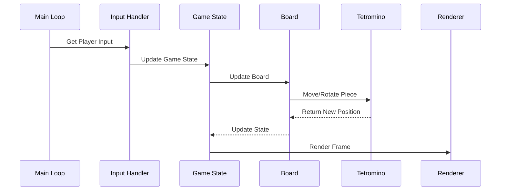

# Tetris Game Architecture

## System Components

### 1. Game Engine (`src/engine/`)

#### Board (`board.py`)
- Manages game grid (20x10 matrix)
- Handles piece placement
- Manages line clearing
- Tracks filled cells

#### Tetromino (`tetromino.py`)
- Defines all 7 tetromino shapes (I, O, T, S, Z, J, L)
- Handles rotation states
- Manages piece coordinates
- Controls piece colors

#### Game State (`game_state.py`)
- Tracks current score
- Manages game speed/level
- Handles game over conditions
- Controls game pause state
- Manages next piece queue

### 2. UI Layer (`src/ui/`)

#### Renderer (`renderer.py`)
- Draws game board
- Renders active piece
- Shows next piece preview
- Displays score/level
- Handles game over screen

#### Input Handler (`input_handler.py`)
- Processes keyboard events
- Maps keys to game actions
- Handles input delays/repeats

## Data Flow


## State Management

### Game States
1. MENU
2. PLAYING
3. PAUSED
4. GAME_OVER

### Board States
- Empty cells (0)
- Filled cells (1-7 for different colors)
- Active piece
- Ghost piece (preview)

## Technical Details

### Grid System
- Size: 20 rows × 10 columns
- Coordinate System: (0,0) at top-left
- Cell Values: 0 for empty, 1-7 for colors

### Rotation System
- Based on SRS (Super Rotation System)
- 4 rotation states per piece
- Wall kick data for edge cases

### Scoring System
- Single line: 100 × level
- Double lines: 300 × level
- Triple lines: 500 × level
- Tetris (4 lines): 800 × level
- Soft drop: 1 point per cell
- Hard drop: 2 points per cell

### Speed Formula
```python
frame_delay = max(50, 800 - (level * 50))  # in milliseconds